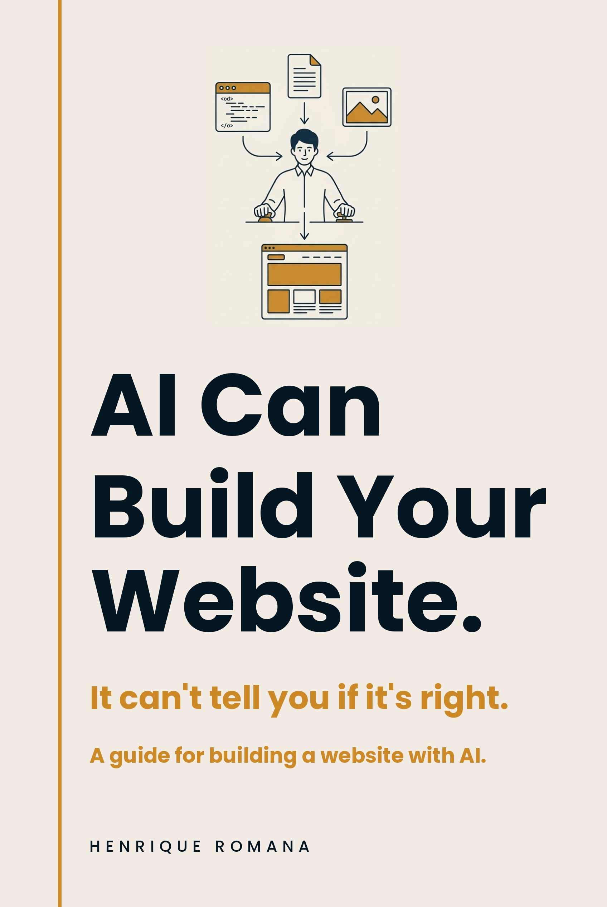

# AI Can Build Your Website.

Practical templates and checklists for people building websites with AI coding agents without giving up control of the project.

These resources accompany *AI Can Build Your Website.* by Henrique Romana.

[View the book on Amazon](https://www.amazon.com/dp/B0HKST1NS1)

## What this repository is

This is the practical toolkit accompanying the book. It helps you define the work, protect settled decisions, review what an agent changes and publish deliberately.

The coding agent can produce the implementation. The human owner still owns the purpose, facts, design judgement, scope, approvals, review and release.

## Who it is for

This repository is for non-developers, founders, marketers, product and project managers, consultants and operators directing AI-assisted website work without necessarily writing production code themselves.

## Start here

1. Define the project with the [project brief](templates/project-brief-template.md).
2. Create the [source of truth](templates/source-of-truth-template.md).
3. Set the [agent instructions](templates/agent-instructions-template.md).
4. Build somewhere safe.
5. Review the result visually.
6. Run the consistency, security and release checks.
7. Prepare the rollback.
8. Publish deliberately, then verify the live result.

## Templates

- [Project brief template](templates/project-brief-template.md)
- [Agent instructions template](templates/agent-instructions-template.md)
- [Source of truth template](templates/source-of-truth-template.md)
- [Decision log template](templates/decision-log-template.md)
- [Rollback plan template](templates/rollback-plan-template.md)

## Checklists

- [Pre-build checklist](checklists/pre-build-checklist.md)
- [Visual review checklist](checklists/visual-review-checklist.md)
- [Cross-site consistency checklist](checklists/cross-site-consistency-checklist.md)
- [Security and privacy checklist](checklists/security-and-privacy-checklist.md)
- [Pre-release checklist](checklists/pre-release-checklist.md)
- [Rollback checklist](checklists/rollback-checklist.md)

## Example

See a [completed project brief for a fictional operations consultant](examples/completed-project-brief-example.md).

## Sample chapter

Read [Chapter 7 — Ask for Exactly What You Want](sample-chapter.md).

## Using these resources with coding agents

Follow the platform-neutral workflow in [How to Use These Resources With Coding Agents](HOW-TO-USE-WITH-CODING-AGENTS.md).

## Resources

The [resources list](resources.md) points to a small set of authoritative references for the work around the agent: Git, previews, accessibility, responsive design, performance, consent, SEO and licensing.

## The book

*AI Can Build Your Website.*  
Henrique Romana

The book is now available on Amazon: [View on Amazon](https://www.amazon.com/dp/B0HKST1NS1).

## About the author

Henrique Romana has spent twenty years in enterprise software at Oracle, SAP, Salesforce and Coupa, working in technology sales, alliances and partnerships. He built and maintains [henriqueromana.com](https://henriqueromana.com) using AI coding agents. He is based in Málaga.

## Licence

The reusable templates and checklists are licensed under CC BY 4.0. The sample chapter and book artwork remain © Henrique Romana. All rights reserved. See [LICENSE.md](LICENSE.md) for the exact split.
