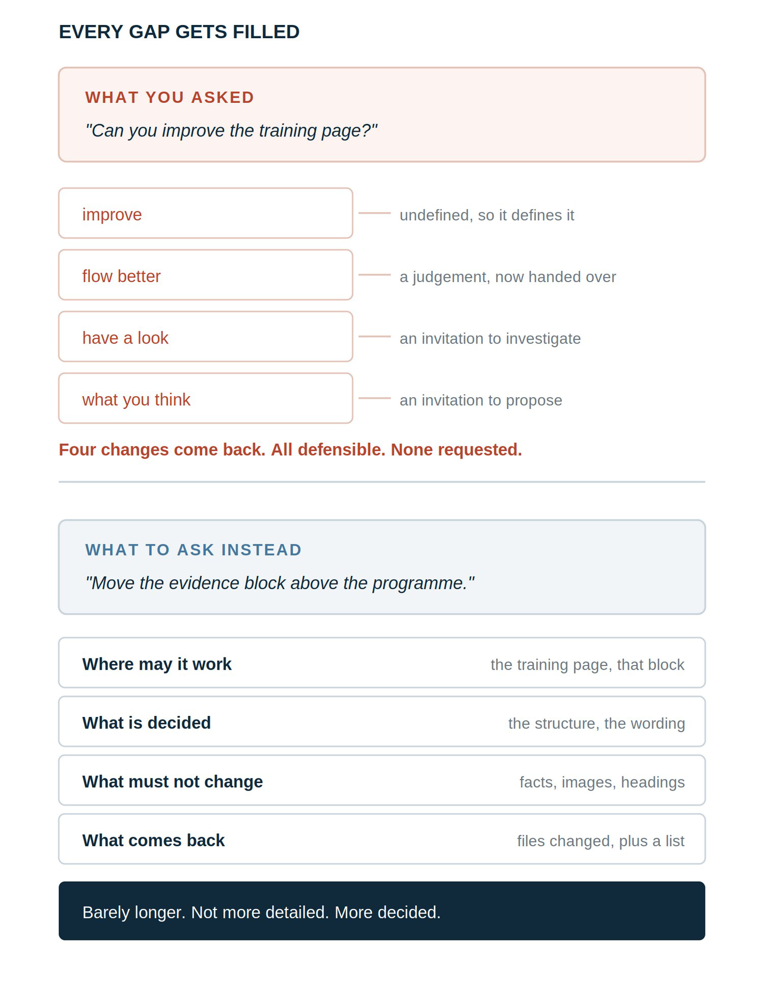

# Chapter 7 — Ask for Exactly What You Want

*Excerpt from AI Can Build Your Website. by Henrique Romana.*

Two things to take from this chapter. A long instruction is not a strong one. What makes an instruction work is saying what is already decided and what must not be touched.

## 7.1 The same job, asked twice

You want the evidence moved higher on the training page. Here are two ways of asking.

The first one:

> Can you improve the training page? The evidence feels like it is too far down and I think the page could flow better overall. Have a look and see what you think.

The second one:

> On the training page, move the evidence block above the section explaining the programme. Change nothing else. The wording of the evidence is approved and must not be reworded. Do not touch the heading, the images or anything below the evidence block. Tell me which files changed.

The first is polite and reads like something you would say to a colleague. It also contains four openings you did not intend to give: improve is undefined, flow is a judgement you handed over, have a look invites investigation, and see what you think invites proposals.

What comes back is a restructured page, a reworded heading, two sections merged because they seemed repetitive, and a note explaining the reasoning. All of it defensible. None of it what you asked for.

> The thing to notice Length is not the difference between those two instructions. The second is longer, but what makes it work is that it says what is closed, not that it says more.

> A vague instruction broken into four gaps, each one a decision the agent makes. Below, the decided version with four stated answers.

Figure 6. Every gap in an instruction is a decision the agent will make for you.

## 7.2 The four things an instruction needs

Not a template to fill in. Four questions your instruction should answer, in whatever order reads naturally.

- Where may it work? Which page, which section, which part of the project.

- What is already decided? The things you have settled and are not reopening. This is the one people leave out.

- What must not change? Facts, wording, images, addresses, anything approved.

- What do you want back? Which files changed, what it did, what it noticed but left alone.

The second and third do the protective work. The first tells the agent where it may go. Those two tell it what is not its business while it is there.

## 7.3 Say what is closed

This is the single habit worth building, and it is the least obvious.

When you leave a decision open, an agent will make it, because an unstated decision looks like a gap to be filled rather than a boundary. Stating that something is settled is what converts it from a gap into a constraint.

“Improve the page”

Closed, so it does not: “The structure is settled. Move one block and change nothing else.”

“Make the wording better”

Closed, so it does not: “The wording is approved. Do not reword it.”

“Tidy up the images”

Closed, so it does not: “The images are the approved files. Do not replace them.”

“Make it consistent”

Closed, so it does not: “Match the spacing rule. Leave the differing heights, they are deliberate.”

Notice that the closed version is barely longer. Not more detailed. More decided.

## 7.4 Ask for observations separately

The agent will notice things. Some of them will be genuinely useful, and you do not want to lose that.

So split noticing from doing.

> Ask the agent “Do the change described above and nothing else. If you notice anything that looks wrong, inconsistent or out of date, list it at the end of your report instead of fixing it.” “List it instead of fixing it” is the whole sentence. It keeps everything valuable about a capable agent noticing problems, without any of it becoming an edit you did not review.

That list is often the most useful part of the report. It is also a list you can act on later, one item at a time, instead of receiving as a fait accompli.

## 7.5 Match the ceremony to the job

Some requests deserve a plan before any work starts. Others do not.

Ask for a plan first when the work touches several pages, changes something shared, involves a decision you have not fully made, or is heading for publication. Seeing the scope before it becomes a fact is the point.

Skip the ceremony for a typo, one factual correction, a single obvious swap. Asking for a three-phase plan with estimates to change one word produces theatre, teaches you nothing, and trains you to skim the plans you should be reading.

The purpose of a plan is to make scope visible. Where scope is already obvious, it has no purpose.

## 7.6 Give permission to do nothing

This one is counterintuitive and it matters more than it sounds.

If you ask an agent to check something, it will tend to find something, because completing a check feels like producing findings. So it adjusts a component that was fine, and you now have a change to review, a small regression risk, and nothing gained.

Say the opposite explicitly:

> If nothing is genuinely wrong, make no changes and tell me that. Reporting that everything is correct is a complete answer.

Then treat that answer as a success when you get it, because it is one. An audit that finds nothing has told you your site is in the state you thought it was, which is worth knowing and costs nothing to act on.

## 7.7 When you ask for less, say what has to survive

There is a subtler version of the gap problem, and it appears whenever you ask for something to be shortened.

I had recommendations that were too long for the space, so I asked for them to be cut down. They came back shorter, correctly shorter, and worth considerably less.

The instruction was followed exactly. What it had not said was which part was doing the work. Asked to shorten, an agent cuts by length and by smoothness, and in a recommendation the valuable part is usually the awkward one: a specific result, a named situation, a sentence running longer than the rest because it is carrying something concrete. The warm general praise survives, and anyone could have written it about anyone.

The fix is to ask for a different operation. Not shorter. Selected.

> Ask the agent “This is too long for the space. Do not summarise it. Choose the part that carries the most weight and use that, keeping the wording exactly as it is.” “Do not summarise” is the whole instruction. Summarising averages a thing out. Selecting keeps somebody’s actual words, which is what made the quotation worth having.

The same applies to trimming a case study, an About page, any paragraph that was doing a job. Each has a part carrying the value and a part that is connective tissue, and length cannot tell them apart.

> The rule Whenever you ask for less of something, add one line saying what has to survive. Otherwise you have handed over a decision you did not know you were making.

## 7.8 Ask for the review you actually need

Everything above is about instructing the tool that changes your files. This section is about the other one: the assistant you use to think, discuss and review.

The default behaviour of that assistant is encouraging. It will find something to praise, soften what is weak, and frame a problem as an opportunity. That is pleasant and it is useless when what you need is to know whether the work is any good.

So ask for the opposite, explicitly. I called it brutal mode, and it is not a setting or a feature. It is a standing instruction.

### What it is

Brutal mode means removing the layer of encouragement that makes weak work sound acceptable. The assistant is asked to identify what is unclear, generic, repetitive, unsupported or unnecessary, and to say so plainly even when the answer is uncomfortable.

It does not mean hostility. Hostility is a tone, and tone is not the point. What changes is what the assistant is trying to achieve: not to make you feel good about the work, but to find what is wrong with it.

### What makes it work

The instruction on its own is not enough, and this is the part people skip.

“Be brutal” produces a different failure from flattery, not an absence of failure. An assistant asked to be harsh will find things to be harsh about, which is the same manufactured-work problem as section 7.6 wearing different clothes.

So four limits travel with it, always:

- Criticism must be supported. A claim that something is weak has to say what is weak about it.

- Do not invent defects. Nothing gets raised merely to produce findings.

- Do not reopen settled decisions without a reason that was not available when they were settled.

- If nothing is wrong, say so. No change is a complete and acceptable answer.

Those four are not softening. They are what separates honest criticism from performed criticism, and the instruction is not worth giving without them.

### The prompt

> Ask the assistant “Review this work in brutal mode. Be direct and specific. Do not soften criticism with compliments or encouragement. Identify anything that is unclear, generic, repetitive, unsupported, unnecessary or likely to weaken credibility. Do not invent problems merely to produce findings. Distinguish confirmed defects from subjective preferences and unsupported concerns. Protect approved facts, private information and settled decisions. Do not edit or publish anything. Return: a verdict; the genuine problems in priority order; what should be removed; what should stay unchanged; and any decision that still belongs to me. If no meaningful problem exists, say so clearly and recommend no change.”

The last line is the one that keeps it honest. The second-to-last line is what keeps it a review rather than a rewrite.

### Where it helps and where it does not

Brutal mode is useful for anything where the failure is that something is weak rather than wrong: whether your positioning is clear, whether a page reads as credible, whether the hierarchy works, whether the writing is any good, whether the site looks generic.

It is the wrong tool for anything requiring approval rather than assessment. Whether a fact is true, whether something is legally sound, whether you like it, whether it should be published. Those remain yours, and an assistant instructed to be direct will give you a confident answer to all of them if you ask.

> Why this works The instruction changes what the reviewer is rewarded for. Left alone, an assistant is rewarded for being encouraging and an audit is rewarded for finding something. Both produce noise. State what a good answer looks like, including the answer that nothing is wrong, and you get a review instead.

## 7.9 What it looks like when it is right

What changed

Vague instruction: Four things

Decided instruction: One thing

Wording

Vague instruction: Rewritten, reasonably

Decided instruction: Untouched, because it was approved

Structure

Vague instruction: Rearranged

Decided instruction: Left alone, because it was closed

Things it noticed

Vague instruction: Acted on

Decided instruction: Listed for you

Your review

Vague instruction: Work out what it did and whether you agree

Decided instruction: Check one change, read three notes

A check that finds nothing

Vague instruction: Produces a change anyway

Decided instruction: Reports the all-clear

Asking for something shorter

Vague instruction: Shorter, and worth less

Decided instruction: The valuable part, kept whole

## 7.10 What to do

- Say where it may work, in one line.

- Say what is already decided. This is the line that prevents most unwanted work.

- Say what must not change, naming facts, wording and files specifically.

- Ask for observations as a list, separate from changes.

- Ask for a plan first only when the scope is not already obvious.

- Say that no change is an acceptable answer on anything you are asking it to check.

- When you ask for less, say what has to survive, or the agent cuts by length rather than by value.

- Ask for review in brutal mode, with the four limits attached, when you need to know whether work is good rather than whether it is finished.

> The rule for this chapter An agent fills gaps. Every decision you leave unstated is a gap, and stating that something is settled is what turns it into a boundary. Write what is closed, not just what you want. The same applies to review: say what a good answer looks like, including the answer that nothing is wrong.

---

Continue in the full book.

**[Amazon link — add after publication]**
